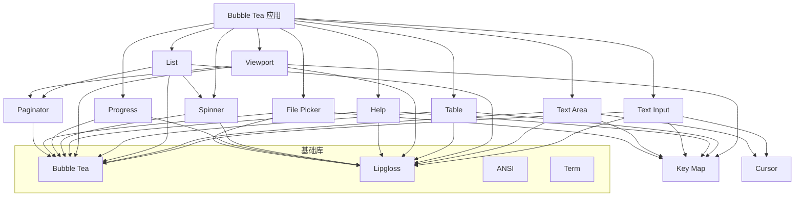
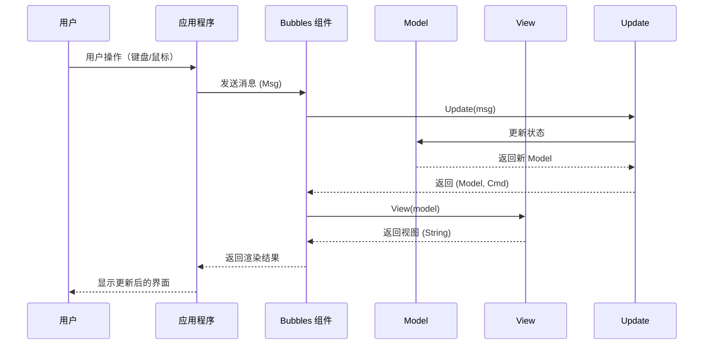

# Bubbles-CN 项目架构概述

## 项目简介

Bubbles-CN 是一个为 Bubble Tea 应用程序提供可复用组件的 Go 语言库。该项目是基于 Charmbracelet/Bubbles 进行二次开发的衍生项目，主要进行了文档本地化和代码注释的中文翻译工作，便于中文开发者理解和使用。

### 项目基本信息

| 属性 | 值 |
|------|-----|
| **项目名称** | Bubbles-CN |
| **项目类型** | Go 语言库（Library） |
| **开发语言** | Go 1.24.2 |
| **许可证** | MIT License |
| **原始项目** | Charmbracelet/Bubbles |
| **衍生项目** | purpose168/bubbles-cn |
| **维护者** | purpose168@outlook.com |

### 项目定位

Bubbles-CN 是一个专注于终端用户界面（TUI）开发的组件库，为基于 Bubble Tea 框架的应用程序提供丰富、可定制的 UI 组件。这些组件已在生产环境中用于 Glow、Charm 等多个知名应用程序。

## 整体架构设计

### 架构模式

Bubbles-CN 采用**组件化架构模式**，每个组件都是独立的、可复用的模块，遵循 Bubble Tea 的 Elm 架构设计原则：

```
┌─────────────────────────────────────────────────────────────┐
│                      Bubble Tea 应用程序                      │
└─────────────────────────────────────────────────────────────┘
                              │
                              ▼
┌─────────────────────────────────────────────────────────────┐
│                    Bubbles-CN 组件库                         │
├─────────────────────────────────────────────────────────────┤
│  ┌─────────┐  ┌─────────┐  ┌─────────┐  ┌─────────┐       │
│  │ Spinner │  │ Text    │  │ Table   │  │ List    │       │
│  │  加载   │  │ Input   │  │  表格   │  │  列表   │       │
│  └─────────┘  └─────────┘  └─────────┘  └─────────┘       │
│                                                               │
│  ┌─────────┐  ┌─────────┐  ┌─────────┐  ┌─────────┐       │
│  │Progress │  │Viewport │  │Help     │  │Key      │       │
│  │ 进度条   │  │ 视口    │  │ 帮助    │  │ 按键    │       │
│  └─────────┘  └─────────┘  └─────────┘  └─────────┘       │
│                                                               │
│  ┌─────────┐  ┌─────────┐  ┌─────────┐  ┌─────────┐       │
│  │Timer    │  │Stopwatch│  │File     │  │Cursor   │       │
│  │ 计时器   │  │ 秒表    │  │ Picker  │  │ 光标    │       │
│  └─────────┘  └─────────┘  └─────────┘  └─────────┘       │
└─────────────────────────────────────────────────────────────┘
                              │
                              ▼
┌─────────────────────────────────────────────────────────────┐
│                   依赖的基础库                                │
├─────────────────────────────────────────────────────────────┤
│  • Bubble Tea (Elm 架构框架)                                 │
│  • Lipgloss (样式和布局)                                      │
│  • ANSI (终端控制)                                           │
│  • Term (终端抽象)                                           │
└─────────────────────────────────────────────────────────────┘
```

### 核心设计原则

1. **Elm 架构模式**：遵循 Model-View-Update (MVU) 架构
2. **组件独立性**：每个组件都是独立的、可单独使用的模块
3. **可组合性**：组件之间可以自由组合使用
4. **可定制性**：提供丰富的样式和行为配置选项
5. **消息驱动**：基于消息传递的状态更新机制

## 核心组件关系

### 组件层次结构

```
Bubbles-CN
│
├── 基础组件
│   ├── key          - 键绑定管理（非可视化）
│   ├── cursor       - 光标管理
│   └── runeutil     - 字符工具函数
│
├── 输入组件
│   ├── textinput    - 单行文本输入
│   └── textarea     - 多行文本输入
│
├── 显示组件
│   ├── spinner      - 加载指示器
│   ├── progress     - 进度条
│   ├── table        - 表格显示
│   ├── list         - 列表显示
│   └── help         - 帮助信息
│
├── 导航组件
│   ├── viewport     - 滚动视口
│   ├── paginator    - 分页器
│   └── filepicker   - 文件选择器
│
└── 时间组件
    ├── timer        - 倒计时器
    └── stopwatch    - 秒表
```

### 组件依赖关系图



## 技术架构图

### 分层架构

```
┌─────────────────────────────────────────────────────────────┐
│                      应用层 (Application)                     │
│              使用 Bubbles-CN 组件的业务应用程序                │
└─────────────────────────────────────────────────────────────┘
                              │
                              ▼
┌─────────────────────────────────────────────────────────────┐
│                      组件层 (Components)                      │
│  ┌──────────┐ ┌──────────┐ ┌──────────┐ ┌──────────┐        │
│  │ 输入组件  │ │ 显示组件  │ │ 导航组件  │ │ 时间组件  │        │
│  │ TextInput│ │ Spinner  │ │ Viewport │ │  Timer   │        │
│  │ TextArea │ │ Progress │ │Paginator │ │Stopwatch │        │
│  └──────────┘ └──────────┘ └──────────┘ └──────────┘        │
└─────────────────────────────────────────────────────────────┘
                              │
                              ▼
┌─────────────────────────────────────────────────────────────┐
│                      框架层 (Framework)                      │
│  ┌──────────────┐  ┌──────────────┐  ┌──────────────┐     │
│  │  Bubble Tea  │  │   Lipgloss   │  │  Key Binding │     │
│  │  Elm 架构     │  │  样式和布局   │  │  键位管理     │     │
│  └──────────────┘  └──────────────┘  └──────────────┘     │
└─────────────────────────────────────────────────────────────┘
                              │
                              ▼
┌─────────────────────────────────────────────────────────────┐
│                      基础层 (Infrastructure)                 │
│  ┌──────────┐  ┌──────────┐  ┌──────────┐  ┌──────────┐   │
│  │   ANSI   │  │   Term   │  │ Cellbuf  │  │  Runes   │   │
│  │ 终端控制  │  │ 终端抽象  │  │ 单元格   │  │ 字符处理  │   │
│  └──────────┘  └──────────┘  └──────────┘  └──────────┘   │
└─────────────────────────────────────────────────────────────┘
                              │
                              ▼
┌─────────────────────────────────────────────────────────────┐
│                      系统层 (System)                         │
│                   操作系统终端 / 控制台                       │
└─────────────────────────────────────────────────────────────┘
```

### MVU 架构流程



## 核心设计模式

### 1. Elm 架构 (MVU)

每个组件都遵循 Elm 架构的三要素：

- **Model**: 组件的状态数据结构
- **View**: 将 Model 渲染为可显示的字符串
- **Update**: 处理消息并更新 Model

```go
// 示例：TextInput 组件的 MVU 结构
type Model struct {
    Value    string    // Model: 状态
    Cursor   int
    Prompt   string
}

func (m Model) View() string {
    // View: 渲染
    return m.Prompt + m.Value
}

func (m Model) Update(msg tea.Msg) (Model, tea.Cmd) {
    // Update: 更新状态
    switch msg := msg.(type) {
    case tea.KeyMsg:
        // 处理按键
    }
    return m, nil
}
```

### 2. 组件组合模式

组件可以自由组合，形成复杂的 UI：

```go
type Model struct {
    textInput textinput.Model
    list      list.Model
    help      help.Model
}

func (m Model) View() string {
    return lipgloss.JoinVertical(
        lipgloss.Left,
        m.textInput.View(),
        m.list.View(),
        m.help.View(),
    )
}
```

### 3. 键绑定模式

使用 `key.Binding` 统一管理键盘快捷键：

```go
type KeyMap struct {
    Up    key.Binding
    Down  key.Binding
    Enter key.Binding
}

var DefaultKeyMap = KeyMap{
    Up:    key.NewBinding(key.WithKeys("k", "up")),
    Down:  key.NewBinding(key.WithKeys("j", "down")),
    Enter: key.NewBinding(key.WithKeys("enter")),
}
```

### 4. 样式分离模式

使用 Lipgloss 将样式与逻辑分离：

```go
var (
    focusedStyle = lipgloss.NewStyle().Foreground(lipgloss.Color("205"))
    blurredStyle = lipgloss.NewStyle().Foreground(lipgloss.Color("240"))
)

func (m Model) View() string {
    style := focusedStyle
    if !m.Focused() {
        style = blurredStyle
    }
    return style.Render(m.text)
}
```

## 数据流架构

### 消息传递流程

```
用户输入
   │
   ▼
┌─────────────┐
│  tea.KeyMsg │
└─────────────┘
   │
   ▼
┌─────────────────────────────────────┐
│         Bubble Tea Runtime           │
│         (消息分发器)                  │
└─────────────────────────────────────┘
   │
   ├──────────────┬──────────────┐
   ▼              ▼              ▼
┌─────────┐  ┌─────────┐  ┌─────────┐
│Component│  │Component│  │Component│
│  Model  │  │  Model  │  │  Model  │
└─────────┘  └─────────┘  └─────────┘
   │              │              │
   ▼              ▼              ▼
┌─────────┐  ┌─────────┐  ┌─────────┐
│ Update  │  │ Update  │  │ Update  │
└─────────┘  └─────────┘  └─────────┘
   │              │              │
   ▼              ▼              ▼
┌─────────┐  ┌─────────┐  ┌─────────┐
│  View   │  │  View   │  │  View   │
└─────────┘  └─────────┘  └─────────┘
   │              │              │
   └──────────────┴──────────────┘
                  │
                  ▼
         ┌─────────────┐
         │  渲染输出    │
         └─────────────┘
```

### 状态管理

每个组件维护自己的状态，通过消息进行通信：

```go
// 组件内部状态
type Model struct {
    // 状态字段
    items    []Item
    cursor   int
    selected int
    filtered bool
}

// 状态更新
func (m Model) Update(msg tea.Msg) (Model, tea.Cmd) {
    var cmd tea.Cmd
    
    switch msg := msg.(type) {
    case tea.KeyMsg:
        switch {
        case key.Matches(msg, m.keyMap.Up):
            m.cursor = max(0, m.cursor-1)
        case key.Matches(msg, m.keyMap.Down):
            m.cursor = min(len(m.items)-1, m.cursor+1)
        }
    }
    
    return m, cmd
}
```

## 扩展性设计

### 自定义组件

开发者可以基于 Bubbles-CN 创建自定义组件：

```go
// 自定义组件示例
type CustomComponent struct {
    // 自定义状态
    data     []string
    cursor   int
    keyMap   key.KeyMap
    styles   Styles
}

// 实现 Bubble Tea 接口
func (c CustomComponent) Init() tea.Cmd {
    return nil
}

func (c CustomComponent) Update(msg tea.Msg) (tea.Model, tea.Cmd) {
    // 实现更新逻辑
    return c, nil
}

func (c CustomComponent) View() string {
    // 实现渲染逻辑
    return ""
}
```

### 组件继承与组合

```go
// 组合多个组件
type AppModel struct {
    textInput textinput.Model
    list      list.Model
    progress  progress.Model
}

// 初始化
func NewAppModel() AppModel {
    return AppModel{
        textInput: textinput.New(),
        list:      list.New(),
        progress:  progress.New(progress.WithDefaultGradient()),
    }
}
```

## 性能优化

### 1. 视口优化

- 使用备用屏幕缓冲区提高渲染性能
- 只渲染可见区域的内容
- 支持增量更新

### 2. 文本处理优化

- 使用 `runeutil` 进行高效的字符处理
- 支持多字节字符（Unicode）
- 文本换行和截断优化

### 3. 内存管理

- 避免不必要的字符串分配
- 使用对象池复用对象
- 及时清理不再使用的资源

## 安全性考虑

### 1. 输入验证

- 文本输入支持验证函数
- 文件选择器限制访问范围
- 防止缓冲区溢出

### 2. 终端安全

- 正确处理特殊字符
- 防止终端转义序列注入
- 安全的剪贴板操作

## 总结

Bubbles-CN 项目采用组件化架构设计，基于 Bubble Tea 的 Elm 架构模式，提供了一套完整、可复用的终端 UI 组件库。项目具有良好的扩展性、可定制性和性能优化，为开发者提供了构建高质量终端应用程序的坚实基础。

### 架构优势

1. **模块化设计**: 每个组件独立、可复用
2. **MVU 架构**: 清晰的状态管理和更新机制
3. **可组合性**: 组件之间可以自由组合
4. **可定制性**: 丰富的样式和行为配置
5. **高性能**: 针对终端环境进行了优化
6. **易用性**: 提供默认配置和简单 API

### 适用场景

- 命令行工具 (CLI)
- 终端用户界面 (TUI) 应用
- 系统管理工具
- 开发者工具
- 仪表盘和监控工具
- 交互式终端应用
